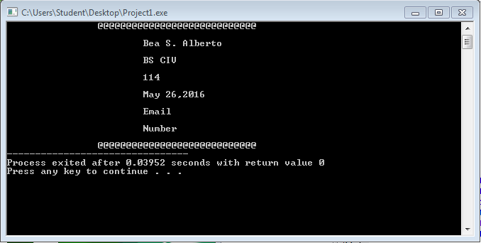
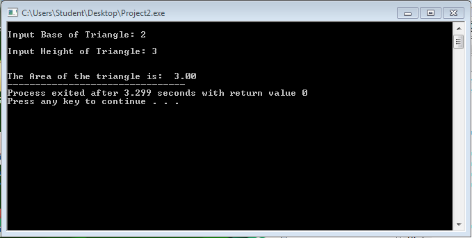

# Activity1-AlbertoB

```
#include <stdio.h>
#include <stdlib.h>


int main() {
	
	int a;
	
	printf("\t\t");
	
	for(a=1;a<=28;a++)
	{
		printf("@");
	}
	
	printf("\n\n\t\t\tBea S. Alberto");
	printf("\n\n\t\t\tBS CIV");
	printf("\n\n\t\t\t114");
	printf("\n\n\t\t\tMay 26,2016");
	printf("\n\n\t\t\tEmail");
	printf("\n\n\t\t\tNumber\n\n\t\t");
	
	for(a=1;a<=28;a++)
	{
		printf("@");
	}
	
	return 0;
	
}
```


```
#include <stdio.h>
#include <stdlib.h>

int main() {
	
	float ba,he,area;
	
	printf("\nInput Base of Triangle: ");
	scanf("%f",&ba);
	printf("\nInput Height of Triangle: ");
	scanf("%f",&he);
	
	area=ba*he*1/2;
	
	printf("\n\nThe Area of the triangle is:  %.2f",area);
	
	return 0;
}
```


```
#include <stdio.h>
#include <stdlib.h>

int main() {
	
	int yr,age;
	
	printf("\nEnter Birth Year: ");
	scanf("%d",&yr);
	
	age=2016-yr;
	
	printf("\nYour approximate age is: %d", age);
	
	
	return 0;
}
```


```
#include <stdio.h>
#include <stdlib.h>

int main() {
	
	float x,y;
	
	printf("Input value of x: ");
	scanf("%f",&x);
	
	y=x/70;
	
	printf("The value of f(x) when f(x)=x/70 is: %.2f",y);
	
	return 0;
}
```

